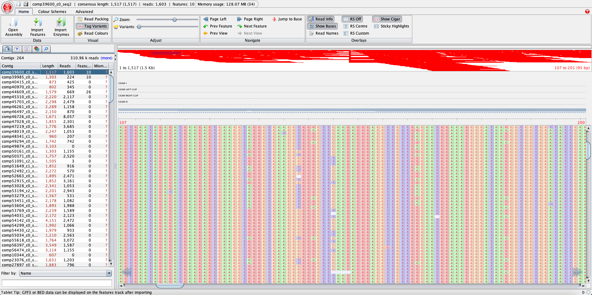

Mapping reads
==============

We will now map our trimmed reads to a reference. We will use as a reference the bait sequence ``Ref.fna`` that is inside the Targeted_enrichment repository we cloned from GitHub. Let's take a look inside this file:

.. code-block:: bash

      less /your/path/to/Targeted_enrichment/Ref.fna

.. code-block:: bash

      >comp39600_c0_seq2
      CGGGCTTTAAGAGGGACCTTCTTGACAATGGAAAGCCTACAAGCCTCCTCCATATTTAAGAGGGACCTTTTTGATAAAATAAAACATATATAAATCCACTTAATCCAGTGAATACAGATGAAGAGTCAACCTAGGCTCAACCTGGGCTTCAAGAGGGACCTTCTTGGCAACGGAAAGTCCATGAGCCTCCTCCATATTCAAGTCATGCCCCTCCATGTTCCCAGCTAGCTGCCACCTGAACCCATGAACGAGATTCGCCAAACTTGATTGAATCACCCTAAGCCCGAGAGGATAGCCCGGGCACATTCTTCTTCCAGCCCCAAATGGCAACAACTCAAAGTCATGACCGTTCACATCAATCTCCTTAGTCGGGCCATCAATGAACCTCTCGGGCTTAAACTCATTGGGCCAGCCCCAAACTGTCGGGTCTCTCCCTATGGCCCACACATTCAAAATCACTTGGGTGCCTTTGGGAACGTCATAGCCATCAATTTTACAGTGCTCCCGGGCTTCCCTTGGGATCAGTGTGGGTGCCACAGGGTGTAACCTCATTGTTTCTTTAACAATTGCTTTAATGTAAGGTAGATTGACCATGTCTTGTTCTTCAACCCATCTGTTTCTACCTACCACATTGTCTAGCTCTTGTTGTGCCTGCTTCAAGACTTGTGGCTTTTTAAGAAGCTCTGACATTGCCCATTCCACTGTTATAGAAGAGCTCTGCGTCCCCCCTATGAGAAGATCCTGAGTAATTGCTTTCACATTATGCTTTTGAAGCTTGACCTCGTGGCTAGGATCATCTGCAGCTTGCAAAAGGAGATCCACCATATCCCTGGCAACATAATTCTTAATCCCTCTTCTTCTGTCATTGTGTTCATTCAATATATGTTCCAAAAACCTCTCAAATTTCTTACTCACGACCTTCATCCTCTTCACATATCCCTGCAAATCCAACAATTCAAGCCAAGGAATGAAATCCCCAATATTCAGAAACCCACTATTCAATAACAGAAACTCATCTAGCATCCACTTGAACTCATCCGGCGTAATAACAGCATTTTCGGTTTTGTTAACGTATGTCTTCCCCAAAACCATGCGACTTATGATGTTGAGGTTGAAAAGGTTGAGGTAGTCCTTTAAGAATATGGTTTTGCCCGAAGAACTGTACAGTTGATTTGCCATGATTCTGATCTCTTCCTTTCTGATATACTCATAGGACTCCAAGCTTTTGGGAGAGAAGAGCTCGGTAAAACAGAGTTTGCGGGCTTGGCGCCAGTATGGGGAGTATGGGGCCCAGATAATGTTGGAGTGGTCGAAACTTGTGTACTTACCGGCCGCAGTTCTCGGCCGCGACGCTAAGGAGCCGTCGTGGGTTTGCAGAAAGGCCTTAGCCATTTTCGCTGAGGAGCCAACGACGACAGACTTTGAGCCTAACCAGAGGTGCATGACGGGTCCGTACTTTTGGGATAGAACATGGAGGGACTTGTGGGGGAATAGGCCTATGAGGTTGAGGTTTCCGA
      >comp39985_c0_seq4
      TTTTTTTATTGTAAAGGGGAGATTTAGTATTGCATTATTTCTTCCATTGTCAAAATGCAAAGGATTACAAGGATCTACAGCTTCGTAGCTGCTTCCATGAAATGTTTCAGTGTTTGGCACTGAAAACAATTCGAATATTTATTTAAAACAAACCAAACTCATTAAAGGCATACATATGTTGGTTAAAAAAAAGAAAAAAAAAAGGCATACATAAAATACACCTCTAAAGAATGCCAATGTTTGATCTAGCACCCTGCATAGTGGCCATCTTCACCCCTCAAAAAGCACTCAATTCGTTCTAGCGCCTCAATAGCAATGGTAGTCGGTGAGATATCTGCAACATCTCTACAGCCCAGTTTTGCAGCAATATTTTCTAAGGACACTCGAGCATTGGCATTGGCATAAGCTTCGCCTCTTTCTTCGAAAAGTGTAGACAAACGCATCAAAGCCCGCTTGTACGCATCTCCTGCTTCATAATGCAGAAGTGGACGAGAATTAGTTCCCACAGCTGCAATTCTCCTGGCCAGGGCTTCTAAAGGTACATCCAACCAAACAGTGATCCCCTTGTGCATATATTTCCAATTGATGGGCCTCACAACTGCACCTCCACCAGTAGAAATTACAAGTCCATGCATAAGTGACAGATTACGCAATACCTCAGTCTCCTTGTCCCTGAAGAAATCCTCTCCATAGTGCTTGAATATATCAGCTACAGAAGTTCCACCAACCTCATGCTCCACCAAGGCATCACTATCAAAAAAGGAATAACCAAGCACTTGTGACAAAATCTTCCCCACAGTTGTCTTCCCTGACCCCATCATTCCAACAAGATATATACAGCGTCCATTTAAATAAGGCTCGATCTCTTGTGTCCTAGTCTGTAACATTAACTCTTCATCAGGAGGGGCCTCTAAGCTTCCAGAGTCCAATGTCAAAGCTGGCAAATTGTCGTAGGAACAAGAAACCTCCAAAGGGGCCGCCCGCCCCCGATTGCGGGAAGGTCTTGCAGTTGCAGGCTGCAAAACACAAATCCGAAGCTTCTGCGGCTCTTCAAAAACTCTAGAGAATTTCACAGAACCACTTAATTTCCTCCCAATCTTCTCGTAATGAATCAATGTTGAGAATTGCAGCCTCTGAGCCGCTTTTGCATCCATGGCGTCGCCGCAAAATAACTGACAACCAGCGTGATATAGCAGTGAACGCAGAGTTTTCAGCACATATACTCAATCCAGATTGACGAGCAGAAAGAAATAAAACGAGAAAATTAATGAACGAAACAGCTCCAGAAATAGGCACGTAAAAG
 
 
This is the sequence of our baits. It has the bait name (e.g. ``>comp39600_c0_seq2`` followed by the sequence itself). We can count how many baits we have in this file by counting the number of ``>`` since each bait name starts with this symbol:

.. code-block:: bash

      cat /your/path/to/Targeted_enrichment/Ref.fna | grep -c ">"

.. code-block::bash

      264

So we have 264 *loci* in our bait set. To map our trimmed reads to the bait set we will use the script ``bam_me.sh``. 

.. dropdown:: bam_me.sh
      :color: info

      .. code-block:: bash

            #! /bin/bash -x
            # Catherine Kidner 28 Oct 2014
            # Assumes all your reads are in a folder called trimmed and all are gzipped.

            echo "Hello world"

            acc=$1

            echo "Working on $1"
            score=G,20,8
            fwd_p=${acc}_trimmed_1.fastq.gz
            rev_p=${acc}_trimmed_2.fastq.gz
            un_p=${acc}_trimmed_1u.fastq,${acc}_trimmed_2u.fastq
            sam=${acc}.sam
            index=${acc}_sorted.bam
            pileup=${acc}.pileup
            vcf=${acc}.vcf
            bowtie=${acc}_bowtie_output
            sorted=${acc}_sorted

            bowtie2 --local --score-min $score -x ./Inga_unique_baits -1 $fwd_p  -2 $rev_p  -U $un_p  -S $sam 2>$bowtie
            samtools view -bS $sam | samtools sort -o $index $sam
            samtools index $index
            samtools mpileup -E -uf Ref.fna  $index > $pileup
            bcftools call -c $pileup > $vcf
            rm *.sam
            rm *.pileup

            exit 0

We can see that this script uses two different software: Bowtie2 and Samtools.  

.. dropdown:: Bowtie2 - extracts from `<http://bowtie-bio.sourceforge.net/bowtie2/index.shtml>`_:
      :color: info

      Here you can see extracts from the Bowtie 2 manual, available at `<http://bowtie-bio.sourceforge.net/bowtie2/index.shtml>`_.

      Bowtie 2 is an ultrafast and memory-efficient tool for aligning sequencing reads to long reference sequences. It is particularly good at aligning reads of about 50 up to 100s or 1,000s of characters to relatively long (e.g. mammalian) genomes. Bowtie 2 indexes the genome with an FM Index (based on the Burrows-Wheeler Transform or BWT) to keep its memory footprint small\: for the human genome, its memory footprint is typically around 3.2 gigabytes of RAM. Bowtie 2 supports gapped, local, and paired-end alignment modes. 

      Bowtie 2 outputs alignments in SAM format, enabling interoperation with a large number of other tools (e.g. SAMtools, GATK) that use SAM. Bowtie 2 is distributed under the GPLv3 license, and it runs on the command line under Windows, Mac OS X and Linux and BSD.

      Bowtie 2 is often the first step in pipelines for comparative genomics, including for variation calling, ChIP-seq, RNA-seq, BS-seq. Bowtie 2 and Bowtie (also called "Bowtie 1" here) are also tightly integrated into many other tools, some of which are listed here.

      **THE bowtie2 ALIGNER**

      ``bowtie2`` takes a Bowtie 2 index and a set of sequencing read files and outputs a set of alignments in SAM format.

      "Alignment" is the process by which we discover how and where the read sequences are similar to the reference sequence. An "alignment" is a result from this process, specifically: an alignment is a way of "lining up" some or all of the characters in the read with some characters from the reference in a way that reveals how they're similar. For example::

            Read:       GACTGGGCGATCTCGACTTCG
                        |||||  |||||||||| |||
            Reference:  GACTG--CGATCTCGACATCG
      
      Where dash symbols represent gaps and vertical bars show where aligned characters match.

      End-to-end alignment versus local alignment

      By default, Bowtie 2 performs end-to-end read alignment. That is, it searches for alignments involving all of the read characters. This is also called an "untrimmed" or "unclipped" alignment.

      When the ``--local`` option is specified, Bowtie 2 performs local read alignment. In this mode, Bowtie 2 might "trim" or "clip" some read characters from one or both ends of the alignment if doing so maximizes the alignment score.

      **Scores: higher = more similar**

      An alignment score quantifies how similar the read sequence is to the reference sequence aligned to. The higher the score, the more similar they are. A score is calculated by subtracting penalties for each difference (mismatch, gap, etc.) and, in local alignment mode, adding bonuses for each match.

      ``--score-min`` Sets a function governing the minimum alignment score needed for an alignment to be considered "valid" (i.e. good enough to report). This is a function of read length. For instance, specifying L,0,-0.6 sets the minimum-score function f to f(x) = 0 + -0.6 * x, where x is the read length. See also: setting function options. The default in ``--end-to-end`` mode is L,-0.6,-0.6 and the default in ``--local`` mode is G,20,8.

      from: https://github.com/BenLangmead/bowtie2/blob/master/MANUAL

.. dropdown:: Samtools: extracts from `<http://www.htslib.org>`_
      :color: info

      Here you can see extracts from Samtools manual, available here `<http://www.htslib.org>`_.

      Samtools is a suite of programs for interacting with high-throughput sequencing data. It consists of three separate repositories:

      Samtools: Reading/writing/editing/indexing/viewing SAM/BAM/CRAM format

      BCFtools: Reading/writing BCF2/VCF/gVCF files and calling/filtering/summarising SNP and short indel sequence variants

      HTSlib: A C library for reading/writing high-throughput sequencing data
      
      Samtools and BCFtools both use HTSlib internally, but these source packages contain their own copies of htslib so they can be built independently.
      
      Samtools is a set of utilities that manipulate alignments in the SAM (Sequence Alignment/Map), BAM, and CRAM formats. It converts between the formats, does sorting, merging and indexing, and can retrieve reads in any regions swiftly.

      .. code-block:: bash
            
            samtools view -bS $sam | samtools sort -o $_sorted.bam $sam
      
      ``view``: With no options or regions specified, prints all alignments in the specified input alignment file (in SAM, BAM, or CRAM format) to standard output in SAM format (with no header). ``-b`` Output in the BAM format. ``-S`` Ignored for compatibility with previous samtools versions. Previously this option was required if input was in SAM format, but now the correct format is automatically detected by examining the first few characters of input.

      ``sort``: Sort alignments by leftmost coordinates, or by read name when ``-n`` is used. An appropriate @HD-SO sort order header tag will be added or an existing one updated if necessary. ``-o`` FILE Write the final sorted output to FILE, rather than to standard output.
      
      .. code-block:: bash
            
            samtools index $index 
            
      ``index``: Index a coordinate-sorted BGZIP-compressed SAM, BAM or CRAM file for fast random access. Note for SAM this only works if the file has been BGZF compressed first.

      .. code-block:: bash

            samtools mpileup -E -uf Ref.fna $index > $pileup

      BCFtools is a set of utilities that manipulate variant calls in the Variant Call Format (VCF) and its binary counterpart BCF. All commands work transparently with both VCFs and BCFs, both uncompressed and BGZF-compressed.

      ``mpileup``: Generate VCF or BCF containing genotype likelihoods for one or multiple alignment (BAM or CRAM) files. This is based on the original samtools mpileup command (with the -v or -g options) producing genotype likelihoods in VCF or BCF format, but not the textual pileup output. **The mpileup command was transferred to bcftools in order to avoid errors resulting from use of incompatible versions of samtools and bcftools when using in the mpileup+bcftools call pipeline.**
      
      Generate VCF, BCF or pileup for one or multiple BAM files. Alignment records are grouped by sample (SM) identifiers in @RG header lines. If sample identifiers are absent, each input file is regarded as one sample. ``-E``, --redo-BAQ Recalculate BAQ on the fly, ignore existing BQ tags ``-uF`` -f, --fasta-ref FILE The faidx-indexed reference file in the FASTA format. The file can be optionally compressed by bgzip. 

      Samtools mpileup can still produce VCF and BCF output (with -g or -u), but this feature is deprecated and will be removed in a future release. Please use bcftools mpileup for this instead. 

      .. code-block:: bash
            
            bcftools call -c $pileup > $vcf`

      This command replaces the former bcftools view caller. Some of the original functionality has been temporarily lost in the process of transition under htslib, but will be added back on popular demand. The original calling model can be invoked with the -c option.

      
First, we need to index the bait set for Bowtie2:

.. code-block:: bash

      bowtie2-build Ref.fna Inga_unique_baits   

.. note::

      Here the name *Inga_unique_baits* is a choice of the user. It will be the name of the indexed baits that Bowtie2 will use for the analysis. You can choose any name of your preference but remember to change accordingly in the ``bam_me.sh`` script, more specifically in the line: ``bowtie2 --local --score-min $score -x ./Inga_unique_baits -1 $fwd_p  -2 $rev_p  -U $un_p  -S $sam 2>$bowtie``. ``Ref.fna`` is the fasta file containing the bait sequence, we will still need it in a later ``samtools`` step.

Now we are ready to run the ``bam_me.sh`` script in a loop:

.. code-block:: bash

      while read f; do ./bam_me.sh "$f" ; done < acc

.. tip::
      In case you are doing your anaylisis in `Crop Diversity HPC <https://help.cropdiversity.ac.uk/index.html>`__, you can run this step as an array. An array job is a job in which the script is run concomitantly for each sample and it will be much quicker. In this link you can find more about array jobs\: `<https://help.cropdiversity.ac.uk/slurm-overview.html#array-jobs>`__. Below an example of how to run the ``bam_me.sh`` script as an array:

      .. code-block::

            #!/bin/bash

            # Assumes all your reads are in a folder called trimmed and all are gzipped.
            # Catherine Kidner 28 Oct 2014
            # Adjusted for an array job in Mar 2022, Flavia Pezzini

            #SBATCH --job-name="bam"
            #SBATCH --export=ALL
            #SBATCH --mail-user=youremail@yourdomain # enter your email to receive a message once it is done.
            #SBATCH --mail-type=END,FAIL
            #SBATCH --output ./slurm-%x-%A_%a.out # %x gives job name, %A job ID, %a array index 
            #SBATCH --partition=long
            #SBATCH --cpus-per-task=16 #this is the number of threads, not cores
            #SBATCH --mem=2G #adjust this according to your data.
            #SBATCH --array=0-4 # the number of samples you have. We have five accessions we use 0-4 because Bash array is zero-indexed (instead of 1-5).

            acc=$(sed -n "$SLURM_ARRAY_TASK_ID"p /path/to/my/acc/file)

            echo "Hello world"

            echo "Working on $acc"

            score=G,20,8
            fwd_p=${acc}_trimmed_1.fastq.gz
            rev_p=${acc}_trimmed_2.fastq.gz
            un_p=${acc}_trimmed_1u.fastq,${acc}_trimmed_2u.fastq
            sam=${acc}.sam
            index=${acc}_sorted.bam
            pileup=${acc}.pileup
            vcf=${acc}.vcf
            bowtie=${acc}_bowtie_output
            sorted=${acc}_sorted

            bowtie2 --local --score-min $score -x ./Inga_unique_baits -1 $fwd_p  -2 $rev_p  -U $un_p  -S $sam 2>$bowtie
            samtools view -bS $sam | samtools sort -o $index $sam 
            samtools index $index
            bcftools mpileup -E -f Baits_all_loci.fna  $index > $pileup 
            bcftools call -c $pileup > $vcf 
            rm ${acc}.sam
            rm ${acc}.pileup

            exit 0

      To submit just type: ``sbatch bam_me_array.sh``

In our folder we now have:

.. code-block:: bash

      FG113                                 FG35_1.fastq.gz                       FGIntype_2.fastq.gz                   KGD465_1.fastq.gz                     fastqctrimfile
      FG113.empties                         FG35_1_fastqc.html                    FGIntype_2_fastqc.html                KGD465_1_fastqc.html                  more_tidying.sh
      FG113.vcf                             FG35_1_fastqc.zip                     FGIntype_2_fastqc.zip                 KGD465_1_fastqc.zip                   renaming.sh
      FG113_1.fastq.gz                      FG35_2.fastq.gz                       FGIntype_bowtie_output                KGD465_2.fastq.gz                     zygia917
      FG113_1_fastqc.html                   FG35_2_fastqc.html                    FGIntype_forward_paired.fq.gz         KGD465_2_fastqc.html                  zygia917.empties
      FG113_1_fastqc.zip                    FG35_2_fastqc.zip                     FGIntype_forward_paired_fastqc.html   KGD465_2_fastqc.zip                   zygia917.vcf
      FG113_2.fastq.gz                      FG35_bowtie_output                    FGIntype_forward_paired_fastqc.zip    KGD465_bowtie_output                  zygia917_1.fastq.gz
      FG113_2_fastqc.html                   FG35_forward_paired.fq.gz             FGIntype_forward_unpaired.fq.gz       KGD465_forward_paired.fq.gz           zygia917_1_fastqc.html
      FG113_2_fastqc.zip                    FG35_forward_paired_fastqc.html       FGIntype_forward_unpaired_fastqc.html KGD465_forward_paired_fastqc.html     zygia917_1_fastqc.zip
      FG113_bowtie_output                   FG35_forward_paired_fastqc.zip        FGIntype_forward_unpaired_fastqc.zip  KGD465_forward_paired_fastqc.zip      zygia917_2.fastq.gz
      FG113_forward_paired.fq.gz            FG35_forward_unpaired.fq.gz           FGIntype_reverse_paired.fq.gz         KGD465_forward_unpaired.fq.gz         zygia917_2_fastqc.html
      FG113_forward_paired_fastqc.html      FG35_forward_unpaired_fastqc.html     FGIntype_reverse_paired_fastqc.html   KGD465_forward_unpaired_fastqc.html   zygia917_2_fastqc.zip
      FG113_forward_paired_fastqc.zip       FG35_forward_unpaired_fastqc.zip      FGIntype_reverse_paired_fastqc.zip    KGD465_forward_unpaired_fastqc.zip    zygia917_bowtie_output
      FG113_forward_unpaired.fq.gz          FG35_reverse_paired.fq.gz             FGIntype_reverse_unpaired.fq.gz       KGD465_reverse_paired.fq.gz           zygia917_forward_paired.fq.gz
      FG113_forward_unpaired_fastqc.html    FG35_reverse_paired_fastqc.html       FGIntype_reverse_unpaired_fastqc.html KGD465_reverse_paired_fastqc.html     zygia917_forward_paired_fastqc.html
      FG113_forward_unpaired_fastqc.zip     FG35_reverse_paired_fastqc.zip        FGIntype_reverse_unpaired_fastqc.zip  KGD465_reverse_paired_fastqc.zip      zygia917_forward_paired_fastqc.zip
      FG113_reverse_paired.fq.gz            FG35_reverse_unpaired.fq.gz           FGIntype_sorted.bam                   KGD465_reverse_unpaired.fq.gz         zygia917_forward_unpaired.fq.gz
      FG113_reverse_paired_fastqc.html      FG35_reverse_unpaired_fastqc.html     FGIntype_sorted.bam.bai               KGD465_reverse_unpaired_fastqc.html   zygia917_forward_unpaired_fastqc.html
      FG113_reverse_paired_fastqc.zip       FG35_reverse_unpaired_fastqc.zip      FGIntype_trimmed_1.fastq              KGD465_reverse_unpaired_fastqc.zip    zygia917_forward_unpaired_fastqc.zip
      FG113_reverse_unpaired.fq.gz          FG35_sorted.bam                       FGIntype_trimmed_1.fastq.gz           KGD465_sorted.bam                     zygia917_reverse_paired.fq.gz
      FG113_reverse_unpaired_fastqc.html    FG35_sorted.bam.bai                   FGIntype_trimmed_1u.fastq             KGD465_sorted.bam.bai                 zygia917_reverse_paired_fastqc.html
      FG113_reverse_unpaired_fastqc.zip     FG35_trimmed_1.fastq                  FGIntype_trimmed_2.fastq              KGD465_trimmed_1.fastq                zygia917_reverse_paired_fastqc.zip
      FG113_sorted.bam                      FG35_trimmed_1.fastq.gz               FGIntype_trimmed_2.fastq.gz           KGD465_trimmed_1.fastq.gz             zygia917_reverse_unpaired.fq.gz
      FG113_sorted.bam.bai                  FG35_trimmed_1u.fastq                 FGIntype_trimmed_2u.fastq             KGD465_trimmed_1u.fastq               zygia917_reverse_unpaired_fastqc.html
      FG113_trimmed_1.fastq                 FG35_trimmed_2.fastq                  Inga_unique_baits.1.bt2               KGD465_trimmed_2.fastq                zygia917_reverse_unpaired_fastqc.zip
      FG113_trimmed_1.fastq.gz              FG35_trimmed_2.fastq.gz               Inga_unique_baits.2.bt2               KGD465_trimmed_2.fastq.gz             zygia917_sorted.bam
      FG113_trimmed_1u.fastq                FG35_trimmed_2u.fastq                 Inga_unique_baits.3.bt2               KGD465_trimmed_2u.fastq               zygia917_sorted.bam.bai
      FG113_trimmed_2.fastq                 FGIntype                              Inga_unique_baits.4.bt2               Ref.fna                               zygia917_trimmed_1.fastq
      FG113_trimmed_2.fastq.gz              FGIntype.empties                      Inga_unique_baits.rev.1.bt2           Ref.fna.fai                           zygia917_trimmed_1.fastq.gz
      FG113_trimmed_2u.fastq                FGIntype.vcf                          Inga_unique_baits.rev.2.bt2           acc                                   zygia917_trimmed_1u.fastq
      FG35                                  FGIntype_1.fastq.gz                   KGD465                                bam_me.sh                             zygia917_trimmed_2.fastq
      FG35.empties                          FGIntype_1_fastqc.html                KGD465.empties                        cut_out                               zygia917_trimmed_2.fastq.gz
      FG35.vcf                              FGIntype_1_fastqc.zip                 KGD465.vcf                            fastqcfiles                           zygia917_trimmed_2u.fastq

The file ``{$acc}_bowtie_output`` shows the aligment summary for the bowtie2 step. We can take a look inside those file with:

.. code-block:: bash

      awk 'FNR==1{print "::::\n"FILENAME"\n::::"}1' *_bowtie_output

You can also visually explore the bam files using the software `Tablet <https://ics.hutton.ac.uk/tablet/>`_. You will need the ``.bam`` and the index ``.bai`` files, which were generated with the ``bam_me.sh`` script. Below is an example of what it looks like. It is a good idea to explore the ``.bam`` files to check how the reads mapped back to the baits.

One of the outputs this script produces is the vcf file. VCF is the standard file format for storing variation data.

.. dropdown:: What are VCF files
      :color: info

      The Variant Call Format (VCF) specifies the format of a text file used in bioinformatics for storing gene sequence variations. The format has been developed with the advent of large-scale genotyping and DNA sequencing projects, such as the 1000 Genomes Project. Existing formats for genetic data such as General feature format (GFF) stored all of the genetic data, much of which is redundant because it will be shared across the genomes. By using the variant call format only the variations need to be stored along with a reference genome. More info: 
      `<http://www.internationalgenome.org/wiki/Analysis/vcf4.0>`_ and 
      `<http://augustogarcia.me/statgen-esalq/Hapmap-and-VCF-formats-and-its-integration-with-onemap/>`_

We will use the script ``clean_vcf.sh`` to edit the vcf files to remove indels and calls with quality less than 36 and then output the consensus fasta. Note that we will need the perl script ``vcfutils_dasta.pl`` in the folder we are working on. 

.. dropdown:: clean_vcf.sh
      :color: info

      .. code-block:: bash

            #! /bin/bash -x
            # to remove tricky stuff from the vcf files and make the fasta
            # Input on comnad line is the accession stem
            #Catherine Kidner 11 Nov 2014

            echo "Hello world"

            acc=$1

            echo "You're working on accession $1"

            vcf=${acc}.vcf
            clean=${acc}_clean.vcf
            fasta=${acc}.fasta

            grep -v "INDEL" $vcf | awk '{if ($6 >= 36) print $0}' > $clean

            perl vcfutils_fasta.pl vcf2fq $clean > $fasta

            rm $clean

            exit 0

.. dropdown:: clean_vcf_array.sh
      :color: info

      .. tip::
            In case you are doing your anaylisis in `Crop Diversity HPC <https://help.cropdiversity.ac.uk/index.html>`__, you can run this step as an array. An array job is a job in which the script is run concomitantly for each sample and it will be much quicker. In this link you can find more about array jobs\: `<https://help.cropdiversity.ac.uk/slurm-overview.html#array-jobs>`__. Below an example of how to run the ``clean_vcf_array.sh`` script as an array:

            .. code-block::

                  #!/bin/bash

                  # to remove tricky stuff from the vcf files and make the fasta
                  # Input on comnad line is the accession stem
                  # Catherine Kidner 11 Nov 2014, adapted to run in array Flavia Pezzini Mar 2021

                  #SBATCH --job-name="clean_vcf"
                  #SBATCH --export=ALL
                  #SBATCH --mail-user=youremail@yourdomain # enter your email to receive a message once it is done.
                  #SBATCH --mail-type=END,FAIL
                  #SBATCH --output ./slurm-%x-%\A_%a.out # %x gives job name, %A job ID, %a array index 
                  #SBATCH --partition=long
                  #SBATCH --cpus-per-task=16 #number of threads, not cores
                  #SBATCH --mem=1G #adjust this according to your data.
                  #SBATCH --array=0-4 # the number of samples you have. We have five accessions we use 0-4 because Bash array is zero-indexed (instead of 1-5).

                  acc=$(sed -n "$SLURM_ARRAY_TASK_ID"p /path/to/my/acc/file)

                  echo "Hello world"

                  echo "Working on $acc"

                  vcf=${acc}.vcf
                  clean=${acc}_clean.vcf
                  fasta=${acc}.fasta

                  grep -v "INDEL" $vcf | awk '{if ($6 >= 36) print $0}' > $clean

                  perl vcfutils_fasta.pl vcf2fq $clean > $fasta

                  rm $clean

                  exit 0

      To submit just type: ``sbatch clean_vcf_array.sh``

Let's run the ``clean_vcf.sh`` script:

.. code-block:: bash

      while read f; do ./clean_vcf.sh.sh "$f" ; done < acc

We now have one fasta file per accession, and each file contains the recovered sequence for each of the 264 *loci*.
      
We will convert from multifastas of loci per accession to multifasta of accession per locus using the python script ``switch_multifastas.py``. This script needs a folder called By_locus, a list of loci called ``locus_list`` and a list of files called ``fasta_files``.

Let's create the folder and lists:

.. code-block:: bash

      mkdir By_locus

.. code-block:: bash

      cat Ref.fna | grep ">" | sed 's/\>//g' > locus_list

.. code-block:: bash

      ls *.fasta > fasta_files

And then run:

.. code-block:: bash

      python /path/to/your/Targeted_enrichment/Switch_multifastas.py

.. dropdown:: Switch_multifastas.py
      :color: info
      
      .. code-block:: python

            '''take a set of multifastas and re-order as by filename a set of multifastas
            For dealing with hyb_baits bowtie to fasta outputs
            needs alist f the fasta file names and a list of the loci (as in the fasta_files)
            set at the default - can change to querry for list names
            needs an output folder called By_locus'''

            def fasta_dict(fastafile):
                  file = open(fastafile)
                  name2seq = {}

                  for line in file:
                        if line.startswith(">"):
                              seq = ''
                              split_line = line.split(' ')
                              name = split_line[0]
                              name = name.rstrip()
                              name = name.lstrip('>')
                        else:
                              seq = seq + str(line)
                              seq = seq.rstrip()

                        name2seq[name] = seq
                  
                  return name2seq

            print ("Hello world")

            fastafile_list = "fasta_files"
            locus_list_file = "locus_list"

            #fastafile_list = input("Which list of fasta files (full file name please)?\n")
            #locus_list_file = input("Which file for names of loci?\n")

            #open files for each locus (for reading and writting) ready to feed in the fastas

            if locus_list_file != None:
                  locus_list = open(locus_list_file)
                  for name in locus_list:
                        name = name.rstrip("\n")
                        out_file_name = name + ".fasta"

                        outfile = open(out_file_name, "w")
                        outfile.close()

            # go through each fasta file pulling out the match to each locus and putting into the file

            if fastafile_list != None:
                  fastafiles = open(fastafile_list)
                  for file_name in fastafiles: 
                        file_name = file_name.rstrip("\n")
                        accession = file_name.rstrip(".fna")

                        #Make a dict of that fasta file

                        ifasta_dict = fasta_dict(file_name)

                        keep_lines_processed = 0
                        keep_seq_found = 0
                        missing_list = []

                        if locus_list_file != None:
                              locus_list = open(locus_list_file)
                              #for a locus pull out the hit and append to the correct file
                              for name in locus_list:
                                    name = name.rstrip("\n")
                                    found_fasta = ">" +  accession + "_" + name + "\n"
                                    keep_lines_processed += 1

                                    fasta_seq = ifasta_dict.get(name, "NNNNNNNNNNNNNNNNNNNNNNNNNNNNNNNNNNNNNNNNNNNNNNNNNNNNNNNNNNNNNNNNNNNNNNNNNNNNNNNNNNNNNNNNNNNNNNNNNNNNNNNNNNNNNNNNNNNNNNNNNNNNNNNNNNNNNNNNNNNNNNNNNNNNNNNNNNNNNNNNNNNNNNNNNNNNNNNNNNNNNNNNNNNNNNNNNNNNNNNNNNNNNNNNNNNNNNNNNNNNNNNNNNNNNNNNNNNNNNNNNNNNNNNNNNNNNNNNNNNN")
                                    if name in ifasta_dict.keys():
                                          keep_seq_found +=1
                                    else:
                                          missing_list.append(name)

                                    found_fasta = found_fasta + fasta_seq + "\n"
                                    locus_file_to_write = "By_locus/" + name + ".fasta"
                                    with open(locus_file_to_write, "a") as myfile:
                                          myfile.write(found_fasta)

                        print("Keep lines processed for " + file_name + "  = " + str(keep_lines_processed))
                        print("Keep sequences found for " + file_name + " = " + str(keep_seq_found))
                        print("Missing for " + file_name + " = " + str("\n".join(missing_list)))
                  

	
			
	
We now have a folder callled ``By_locus`` with 264 fasta files ready to be aligned with `mafft <https://mafft.cbrc.jp/alignment/software/>`_. 